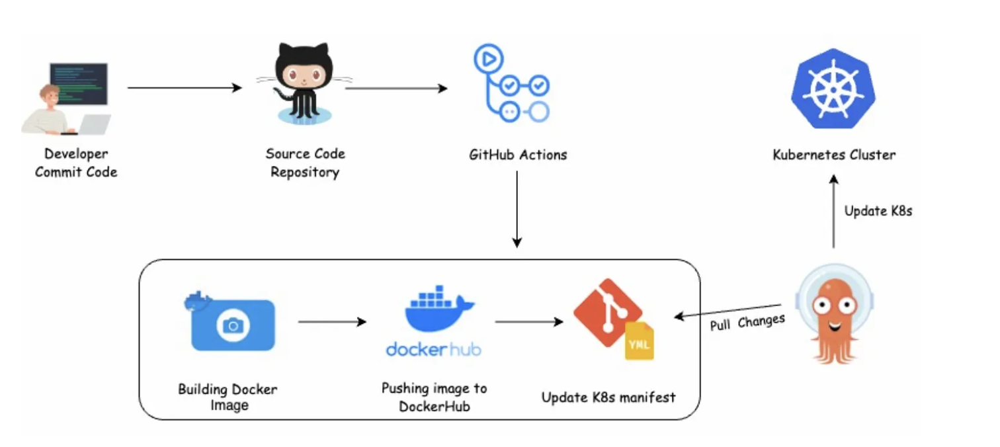
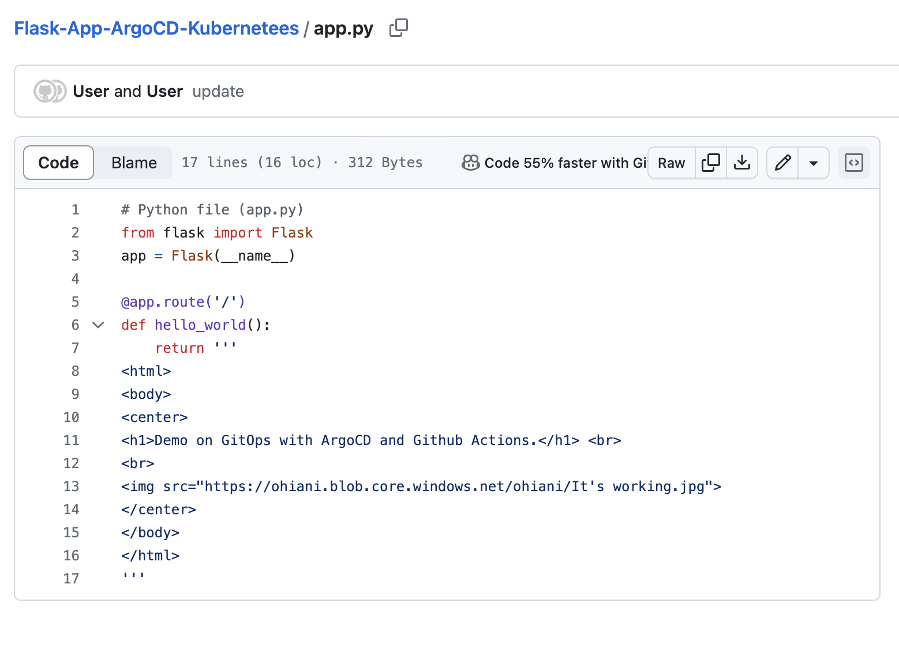
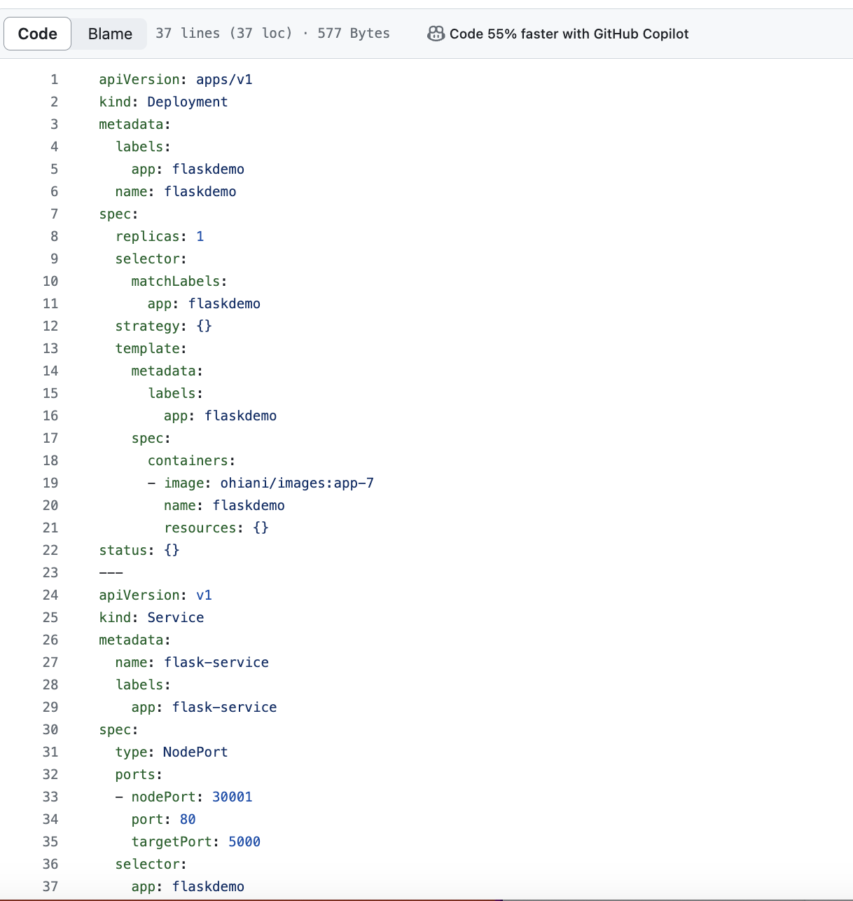
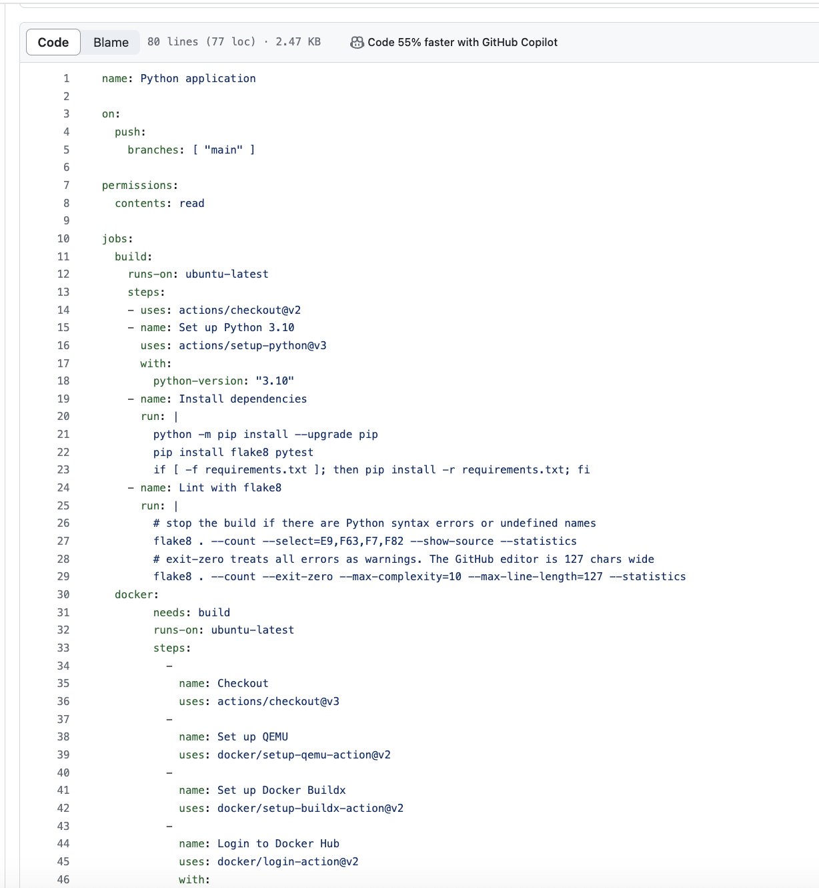
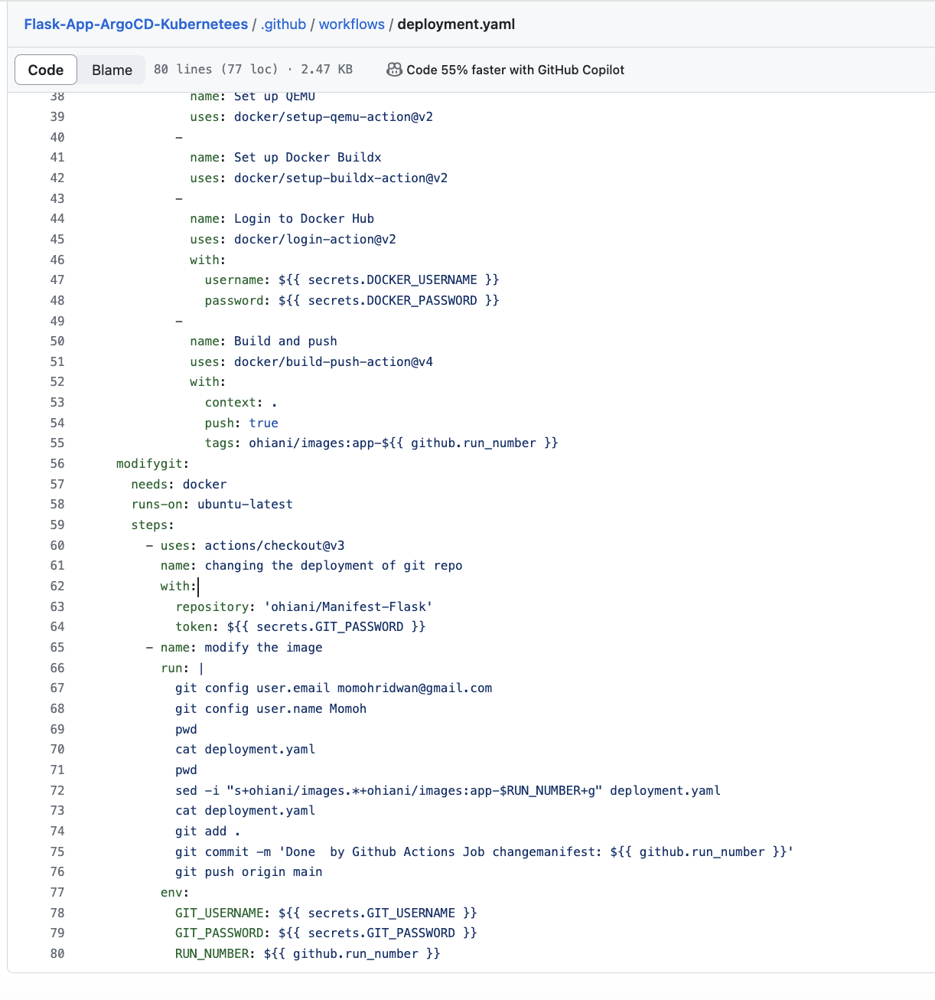
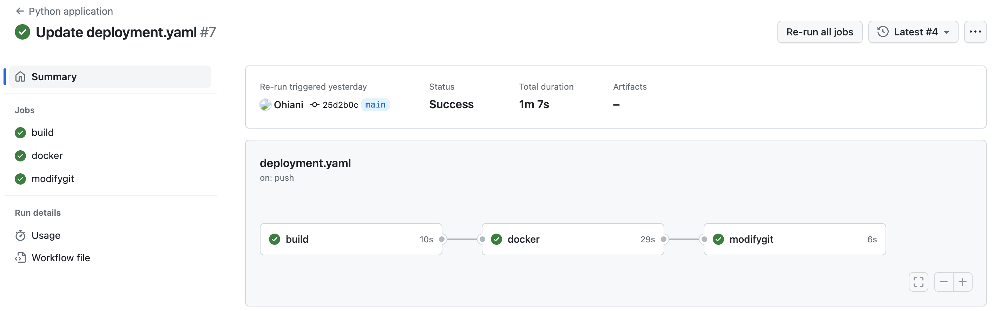
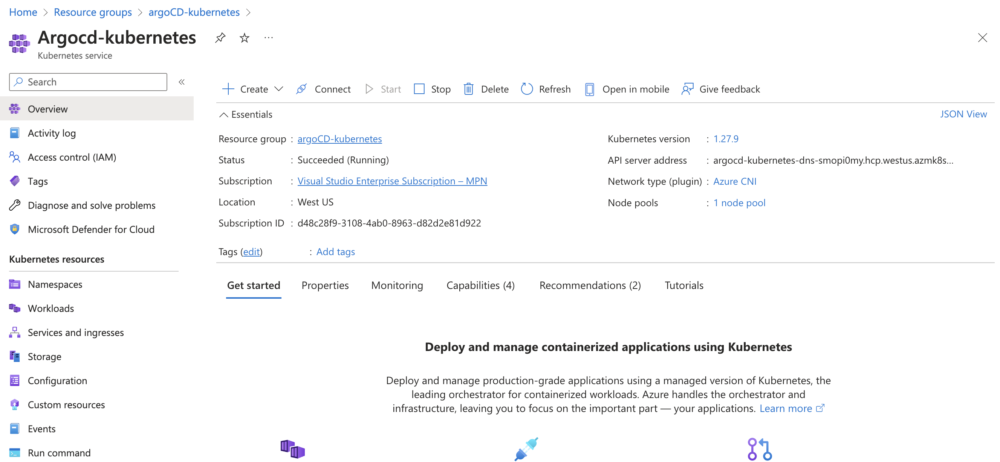
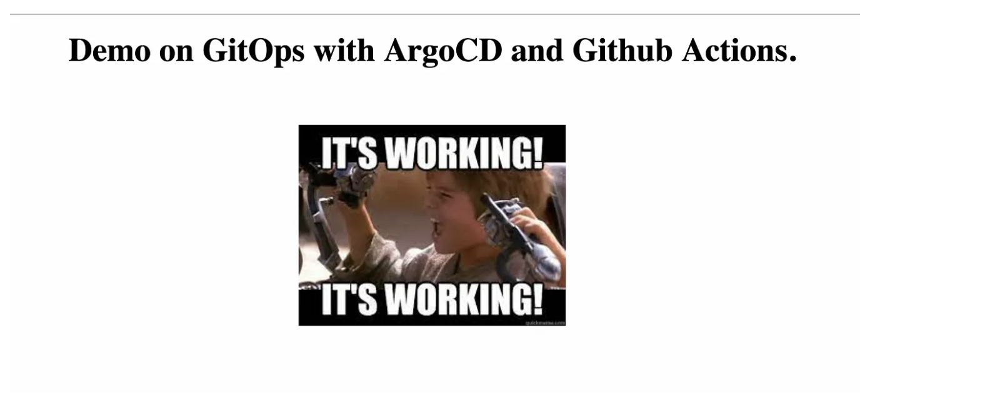

# CI/CD with GitHub, GitHub Actions, Argo CD and Kubernetes Cluster

In this project we will be building a simple python Flask application, dockerize and push to dockerhub, modify a git repo using Github actions. And also deploying to to a kubernetes Cluster on Azure(AKS) using ArgoCD as the continous deployment tool.

# Project Arcchitecture Diagram

# Getting Started

- Create a GitHub repository and put the application source code in it.

For the Application source code repository, we will be using a simple Flask application that displays a web page and this will be packaged in a docker image and published to the DockerHub.

- Create your Kubenetees Manifest repo (Manifest-Flask) 

This serves as your gitops repo for argocd to monitor for anychanges.

- Setup your Github actions workflow on your source code repo 
This workflow would also push changes to out gitops repo so argocd can detect a change and deploy to the cluster 

ArgoCD uses the updated deployment manifests from this workflow to deploy the application in the Kubernetes cluster.

- Deploy your kubernetes Cluster 
for this project we will be create an azure kubernetes cluster

-  Install ArgoCD in your Kubernetes Cluster

- Create a New Application to deploy to Manifest File and also monitor your repository

This automated process not only saves us valuable time but also eliminates the risk of manual errors that often accompany manual resource creation and deployment.

By entering the appropriate Worker Node IP address and the designated NodePort in a web browser or any applicable tool, we can effortlessly establish a connection to the Pod running our application.

We have successfully implemented a highly efficient CI/CD workflow that is now fully automated. As a result, whenever a developer commits changes to the main branch of the Application repository, the updates are seamlessly reflected on the main site without any manual intervention. This automated process eliminates the need for manual deployments, saving us time and effort. 

